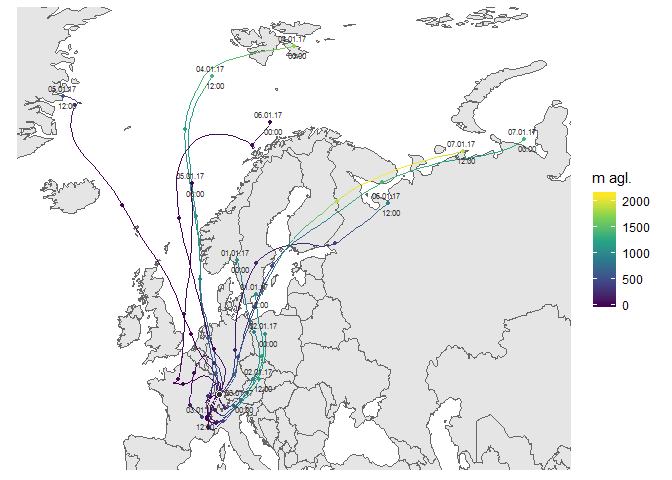

<!-- README.md is generated from README.Rmd. Please edit that file -->


# rOstluft.plot

Erstellen von Diagrammen für Ostluft Auswertungen und Berichte

# Installation

Der Quellcode von
[rOstluft.plot](https://github.com/Ostluft/rOstluft.plot) ist auf github
gehosted. Die einfachste Variante ist die Installation mit Hilfe des
Packages devtools:

``` r
#install.packages("devtools")
devtools::install_github("Ostluft/rOstluft.plot")
```

# Beispiele

## Hysplit Trajektorien:

``` r
library(ggplot2)
library(rOstluft)
library(rOstluft.plot)
fn <- system.file("extdata", "2017_ZH-Kaserne-hysplit.rds", package = "rOstluft.data")
traj <- readRDS(fn)
traj <- dplyr::filter(traj, date < lubridate::ymd("2017-01-08"))
hysplit_traj(traj, color_scale = ggplot2::scale_color_viridis_c(name = "m agl."))
```


## Wind Density

Inspiriert bei [visualising diurnal wind
climatologies](https://www.r-bloggers.com/visualising-diurnal-wind-climatologies-2/)

WIP

``` r
store <- storage_s3_rds("aqmet", format = format_rolf(), bucket = "rostluft", prefix = "aqmet")
data <- store$get(site = "ETHZ_CHN-Gebäude", year = 2017, interval = "h1")
plt_wind_density(data)
```


## Wind Rose mit Background Karte

WIP

``` r
# get needed meta information, one row with x and y coordinates in lsv95
ethz <- store$get_meta("ethz")[[1]]
site <- ethz[1, ]
plt_wind_rose(data, site)
```



``` r
data <- store$get(site = "Zch_Stampfenbachstrasse", year = 2016:2017, interval = "d1")
o3 <- dplyr::filter(data, parameter == "O3_max_h1")
plt_calendar(o3)
```


Messwert als Label, O3\_max\_h1 als Legendentitel, Skala mit bessserer
Lesbarkeit für Label, Marker für
Überschreitung

``` r
scale_fill = scale_fill_viridis_c(name = "max. O3 Stundenmittel", end = 0.9, option = "magma")
marker_opt = list(position = position_nudge(y = 0.2), color = "black", size = 2)
label_opt = list(position = position_nudge(y = -.1), color = "white", size = 3, fontface = "bold")
plt_calendar(o3, scale_fill = scale_fill, label = round(value), marker = value > 120, 
             label_opt = label_opt, marker_opt = marker_opt) + theme(legend.position="top")
```


