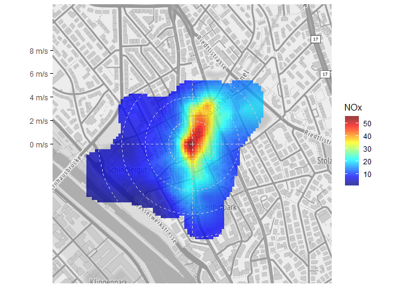
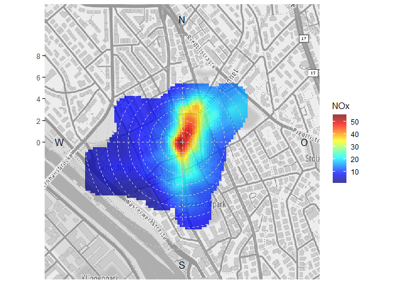
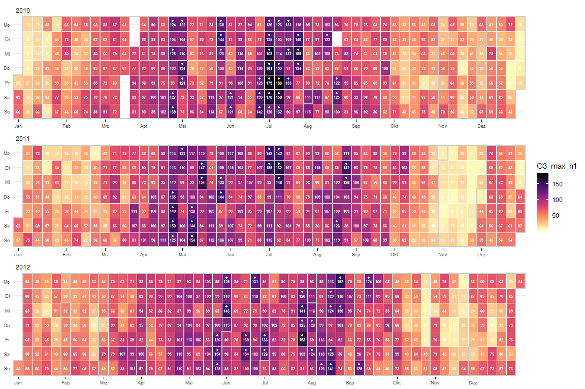
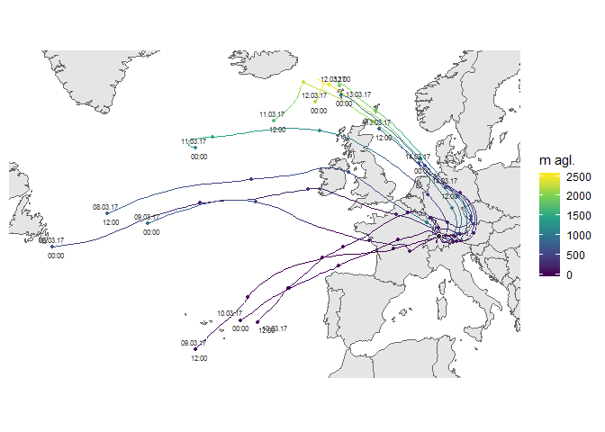

<!-- README.md is generated from README.Rmd. Please edit that file -->


# rOstluft.plot

Erstellen von Diagrammen für Ostluft Auswertungen und Berichte

# Installation

Der Quellcode von
[rOstluft.plot](https://github.com/Ostluft/rOstluft.plot) ist auf github
gehosted. Die einfachste Variante ist die Installation mit Hilfe des
Packages devtools:

``` r
#install.packages("devtools")
devtools::install_github("Ostluft/rOstluft.plot")
```

# Beispiele

``` r
library(ggplot2)
library(rOstluft.plot)

data <-
  rOstluft::read_airmo_csv(system.file("extdata", "Zch_Stampfenbachstrasse_2010-2014.csv", package = "rOstluft.data", mustWork = TRUE)) %>%
  rOstluft::rolf_to_openair() %>%
  openair::cutData(date, type = "daylight") %>% 
  dplyr::mutate(year = lubridate::year(date))
```

## Windrose auf Karte

``` r
bbox <- tibble::tibble(x = c(2683141 - 500, 2683141 + 500), y = c(1249040 - 500, 1249040 + 500))
bbox <- rOstluft::transform_LV95_to_WSG84(bbox)
bbox <- c(left = bbox$lon[1], right = bbox$lon[2], bottom = bbox$lat[1], top = bbox$lat[2])
raster_map <- ggmap::get_stamenmap(bbox, zoom = 16, maptype = "terrain",
                                   source = "stamen", color = "bw")

plot <- ggwindrose(data, aes(ws = ws, wd = wd), wd_binwidth = 22.5, 
                   wd_cutfun = cut_wd.fun(binwidth = 22.5), 
                   ws_cutfun = cut_ws.fun(binwidth = 0.5, ws_max = 2.5, reverse = TRUE), 
                   bg = raster_map)

plot
```


``` r
plot + facet_wrap(daylight~.)
```


## Radar-chart Windstatistik

``` r
df <-
  rOstluft::read_airmo_csv(system.file("extdata", "Zch_Stampfenbachstrasse_2010-2014.csv",package = "rOstluft.data", mustWork = TRUE)) %>%
  rOstluft::rolf_to_openair() %>%
  dplyr::mutate(wday = lubridate::wday(date, label = TRUE, week_start = 1))

ggradar(df, aes(wd = wd, ws = ws, z = NOx), 
        param_args = list(fill = "blue", color = "blue", alpha = 0.5)) + ylab("NOx")
```


``` r
df <- openair::cutData(df, date, type = "daylight") %>% 
  dplyr::select(wd, ws, NO, NOx, daylight) %>% 
  tidyr::gather(par, val, -wd, -ws, -daylight)
 
ggradar(df, aes(wd = wd, ws = ws, z = val, group = par, fill = par, color = par)) + ylab("mean") +
  facet_wrap(daylight~.)
```


## polarplot openair-style

``` r
fill_scale = scale_fill_gradientn(colours = alpha(matlab::jet.colors(100), 0.75), na.value = NA)
ggpolarplot(data, aes(wd = wd, ws = ws, z = NOx), bg = raster_map, 
            fill_scale = fill_scale, breaks = seq(0,10,2))
```



## Tagesgang-Jahresgang heatmap

``` r
ggyearday(data, time = "date", z = "O3") +
  facet_wrap(year~., scales = "free_x", ncol = 1)
```



## Kalender + stat\_filter

Kalender der max Stundenwerte des Tages von Ozon

``` r
statstable <- tibble::tribble(
  ~parameter, ~statistic, ~from, ~to,
  "O3", "mean", "input", "h1",
  "O3", "max", "h1", "d1"
)

data_d1 <- 
  rOstluft::read_airmo_csv(system.file("extdata", "Zch_Stampfenbachstrasse_2010-2014.csv",package = "rOstluft.data", mustWork = TRUE)) %>%
  rOstluft::calculate_statstable(statstable) %>%
  purrr::pluck("d1") %>% 
  rOstluft::rolf_to_openair()

  
ggcalendar(data_d1, z = "O3_max_h1") +
  scale_fill_viridis_c(direction = -1, option = "magma", na.value = NA) +
  cal_month_border(color = "white") +
  stat_filter(aes(filter = O3_max_h1 > 120), size = 0.75, color = "green", fill = NA, shape = 21) +
  cal_label(aes(label = round(O3_max_h1,0)), fontface = "bold")
```



## Hysplit Trajektorien (openair data format)

``` r
fn <- system.file("extdata", "2017_ZH-Kaserne-hysplit.rds", package = "rOstluft.data")
traj <- readRDS(fn)
traj <- dplyr::filter(traj, date < lubridate::ymd("2017-01-08"))

ggtraj(traj, color_scale = ggplot2::scale_color_viridis_c(name = "m agl."))
```


