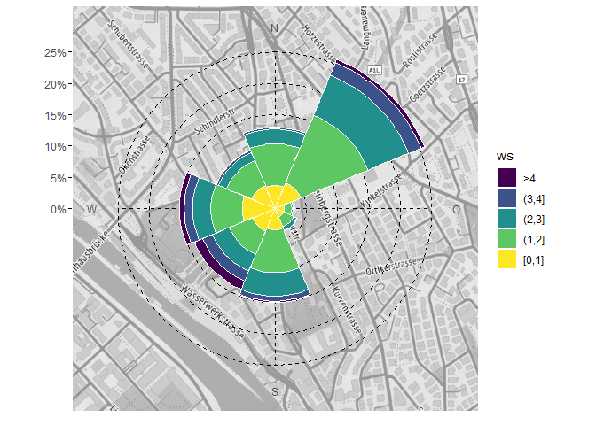

# rOstluft.plot

Erstellen von Diagrammen für Ostluft Auswertungen und Berichte mit Bezug
zu Luftschadstoffen und Meteorologie. Einige Funktionen sind aus dem
package [openair](http://www.openair-project.org) abgeleitet. Alle
plot-Funktionen sind grundsätzlich auf das
[ggplot2](https://ggplot2.tidyverse.org) package bezogen.

# Installation

Der Quellcode von
[rOstluft.plot](https://github.com/Ostluft/rOstluft.plot) ist auf github
gehosted. Die einfachste Variante ist die Installation mit Hilfe des
Packages devtools:

``` r
#install.packages("devtools")
devtools::install_github("Ostluft/rOstluft.plot")
```

# Beispiele

``` r
library(rOstluft.plot)
library(rOstluft)
library(rOstluft.data)
library(ggplot2)
library(dplyr)
library(lubridate)
library(tibble)
library(purrr)
library(scales)
library(openair)

data <-
  rOstluft.data::f("Zch_Stampfenbachstrasse_2010-2014.csv") %>% 
  rOstluft::read_airmo_csv() %>%
  rOstluft::rolf_to_openair() %>%
  openair::cutData(date, type = "daylight") %>% 
  tibble::as_tibble() %>% 
  dplyr::mutate(
    wday = lubridate::wday(date, label = TRUE, week_start = 1),
    year = lubridate::year(date)
  )
```

## Windrose auf Karte

``` r
bb <- bbox_lv95(2683141, 1249040, 500)
bg <- get_stamen_map(bb)

ggwindrose(data, ws, wd, ws_max = 4, bg = bg, ) +
  theme(
    panel.grid.major = element_line(linetype = 2, color = "black", size = 0.5)
   )
```



``` r
# Für Facetten müssen die facet Variablen in groupings enthalten sein:
ggwindrose(data, ws, wd, ws_max = 4, groupings = grp(daylight)) +
  facet_wrap(vars(daylight))
```


``` r
# y Achse kann wie gewohnt mit einer scale_y_continuous angepasst werden
# das untere Limit sollte auf 0 gesetzt werden
ggwindrose(data, ws, wd, ws_max = 4, groupings = grp(daylight)) +
  facet_wrap(vars(daylight)) +
  scale_y_continuous(
    limits = c(0, NA), 
    expand = expand_scale(), 
    labels = scales::percent_format(1),
    breaks = seq(0, 0.3, 0.05)
  )
```


## Radar-chart Windstatistik

``` r
# Simpler Radarplot
ggradar(data, wd, NOx, fill = "gray30", alpha = 0.5, show.legend = FALSE)
```


``` r
# mehrere Statistik Funktionen
q05 <- function(x, ...) quantile(x, 0.05, ...)
q95 <- function(x, ...) quantile(x, 0.95, ...)
stat_reorder <- function(stat) {
  factor(stat, levels = rev(c("perc05", "median", "mean", "perc95")))
}

ggradar(data, wd, NOx,
    fun = list("perc05" = q05, "median", "mean", "perc95" = q95),
    fun_reorder = stat_reorder, color = NA, alpha = 0.9) +
  scale_y_continuous(limits = c(0,120)) +
  scale_fill_viridis_d(begin = 0.2)
```


``` r
# Karte als Hintergrund
bb <- bbox_lv95(2683141, 1249040, 500)
bg <- get_stamen_map(bb)

ggradar(data, wd, NOx, bg = bg, lwd = 1, 
         color = "steelblue", fill = "steelblue", alpha = 0.5) + 
  theme(
    panel.grid.major = element_line(linetype = 1, color = "white"),
    axis.text.x = element_text(color = "gray10")
  )
```


## polarplot openair-style

``` r
fs <- scale_fill_gradientn_squished(
  limits = c(0,50), breaks = seq(0,50,10),
  na.value = NA, colors = matlab::jet.colors(20)
)

ggpolarplot(data, wd = wd, ws = ws, z = NOx, ws_max = 4,
    bg = bg, alpha = 0.6,
    fill_scale = fs, smooth = TRUE, breaks = c(0,2,4)
  ) +
  theme(
    panel.grid.major = element_line(linetype = 2, color = "black", size = 0.5)
  )
```


## Tagesgang-Jahresgang heatmap

``` r
ggyearday(data, time = "date", z = "O3")
```


## Kalender + stat\_filter

Kalender der max Stundenwerte des Tages von Ozon

``` r
statstable <- tibble::tribble(
  ~parameter, ~statistic, ~from, ~to,
  "O3", "mean", "input", "h1",
  "O3", "max", "h1", "d1"
)

data_d1 <- 
  rOstluft.data::f("Zch_Stampfenbachstrasse_2010-2014.csv") %>% 
  rOstluft::read_airmo_csv() %>%
  dplyr::filter(starttime < lubridate::ymd(20130101)) %>% 
  rOstluft::calculate_statstable(statstable) %>%
  purrr::pluck("d1") %>% 
  rOstluft::rolf_to_openair()


ggcalendar(data_d1, z = "O3_max_h1") +
  scale_fill_viridis_c(direction = -1, option = "magma", na.value = NA) +
  cal_month_border(size = 1) +
  stat_filter(
    aes(filter = O3_max_h1 > 120), size = 1, 
    color = "white", fill = "white", shape = 21,
    position = position_nudge(y = 0.25)
  ) +
  cal_label(aes(label = round(O3_max_h1,0)), fontface = "bold")
```


## Hysplit Trajektorien (openair data format)

``` r
fn <- system.file("extdata", "2017_ZH-Kaserne-hysplit.rds", package = "rOstluft.data")
traj <- readRDS(fn)
traj <- dplyr::filter(traj, 
  dplyr::between(lubridate::as_date(date), lubridate::ymd("2017-03-08"), lubridate::ymd("2017-03-14"))
)

# simple
ggtraj(traj)
```


``` r
# Schadstoff statt Trajektorienhöhe
# Interessant für den Transport von Schadstoffen wie EC. In diesem Beispiel wird PM2.5
# verwendet weil keine EC Daten in den Beispieldaten enthalten sind.
data_2017 <-
  rOstluft.data::f("Zch_Stampfenbachstrasse_min30_2017.csv") %>% 
  rOstluft::read_airmo_csv() %>%
  rOstluft::rolf_to_openair() 

data_traj <- 
  dplyr::select(data_2017, -site) %>% 
  dplyr::right_join(traj, by = "date")
  
ggtraj(data_traj, aes(color = PM2.5), 
       color_scale = ggplot2::scale_color_viridis_c(direction = -1))
```


## Squishing data

Messdaten enthalten oft Extremwerte von ausserordentlichen Episoden oder
Ereignissen. Als Beispiel Feuwerwerke oder Inversionen in den PM10
Daten:

``` r
ggyearday(data, time = date, z = PM10)
```


In einem ggplot2 Diagramm kann bei continuous scales mit Hilfe dem
Argument `oob` eine Funktion übergeben werden, was mit Werten ausserhalb
des Limits geschieht. Mit Hilfe der Funktion `scales::squish()` werden
diese Werte auf das Minima, bzw. Maxima der Limits gesetzt. In
rOstluft.plot sind die Hilfsfunktionen `scale_fill_viridis_squished()`,
`scale_color_viridis_squished()`, `scale_fill_gradientn_squished()` und
`scale_color_gradientn_squished()` enthalten:

``` r
fill_scale <- scale_fill_viridis_squished(
  breaks=c(0, 20, 40, 60, 80), 
  limits = c(0, 80),
  direction = -1, 
  na.value = NA, 
  option = "A"
)

ggyearday(data, time = date, z = PM10, fill_scale = fill_scale)
```


Teilweise ist es für Klassierungen praktisch alle Werte über einem
Maximum in einer zusätzlichen Klasse zusammen zu fassen. Die Funktion
`cut_ws()` beinhaltet diese Funktionalität, hat jedoch gewisse
Einschränkungen (Negative Werte werden zu NA, Breite der Klasse fix):

``` r
pm10_right <- cut_ws(data$PM10, binwidth = 20, ws_max = 80)
table(pm10_right)
```

    #> pm10_right
    #>  [0,20] (20,40] (40,60] (60,80]     >80 
    #>   48146   27874    6162    1191     476

``` r
pm10_left <- cut_ws(data$PM10, 20, 80, right = FALSE)

# bei der Umwandlung der Ausgabe nach HTML wird "≥80" in "=80" 
# umgewandelt. In Diagrammen und der R Konsole wird das Zeichen
# jedoch korrekt dargestellt. See https://github.com/r-lib/evaluate/issues/59
table(pm10_left)
```

    #> pm10_left
    #>  [0,20) [20,40) [40,60) [60,80)     =80 
    #>   48146   27874    6162    1191     476

Für mehr Flexibilät kann direkt `base::cut()` verwendet werden und
breaks mit `-Inf` und `Inf` definiert werden.

``` r
breaks <- c(-Inf, 0, 19, 41, 66, 80, Inf)
pm10_cut <- cut(data$PM10, breaks = breaks, right = TRUE, include.lowest = TRUE)
table(pm10_cut)
```

    #> pm10_cut
    #>  [-Inf,0]    (0,19]   (19,41]   (41,66]   (66,80] (80, Inf] 
    #>      1141     45516     31079      6164       614       476

## padding data

Messdaten liegen nicht immer in vollständigen Zeitreihen vor. Für einige
Diagramme ist es jedoch erforderlich, dass für alle Zeitpunkte ein Wert
oder ein NA vorhanden ist. Für Daten im rolf Format können die rOstluft
Funktionen `rOstluft::pad()` und `rOstluft::pad_year()` verwenden
werden. rOstluft.plot enthält 2 generische padding Funktionen:

``` r
fn <- rOstluft.data::f("Zch_Stampfenbachstrasse_min30_2013_Jan.csv")
january <- rOstluft::read_airmo_csv(fn)
january_oa <- rOstluft::rolf_to_openair(january
                                        )
tail(january_oa)
```

    #> # A tibble: 6 x 16
    #>   date                site     CO    Hr    NO   NO2   NOx    O3     p  PM10 RainDur   SO2  StrGlo     T
    #>   <dttm>              <fct> <dbl> <dbl> <dbl> <dbl> <dbl> <dbl> <dbl> <dbl>   <dbl> <dbl>   <dbl> <dbl>
    #> 1 2013-01-31 21:00:00 Zch_~ 0.191  67.3 0.675  7.70  4.57  71.0  970.  7.21   0.583 0.782 0.0138   9.25
    #> 2 2013-01-31 21:30:00 Zch_~ 0.195  64.9 0.359  7.72  4.33  69.7  970.  4.89   1.52  0.851 0.0116   9.49
    #> 3 2013-01-31 22:00:00 Zch_~ 0.191  65.1 0.424  6.84  3.92  69.0  970.  6.71   1.45  0.842 0.00673  9.33
    #> 4 2013-01-31 22:30:00 Zch_~ 0.184  67.3 0.353  5.38  3.09  70.5  970.  5.19   0     0.797 0.0120   9.17
    #> 5 2013-01-31 23:00:00 Zch_~ 0.186  67.3 0.634  5.87  3.58  70.2  969.  5.79   0     0.851 0.0118   9.10
    #> 6 2013-01-31 23:30:00 Zch_~ 0.189  68.7 0.435  6.76  3.88  67.6  969.  7.92   0     0.749 0.0105   9.1 
    #> # ... with 2 more variables: wd <dbl>, ws <dbl>

``` r
# site mit "Zch_Stampfenbachstrasse" füllen
pad_to_year(january_oa, date, "30 min", fill = list(site = "Zch_Stampfenbachstrasse")) %>% 
  tail()
```

    #> # A tibble: 6 x 16
    #>   date                site     CO    Hr    NO   NO2   NOx    O3     p  PM10 RainDur   SO2 StrGlo     T    wd
    #>   <dttm>              <fct> <dbl> <dbl> <dbl> <dbl> <dbl> <dbl> <dbl> <dbl>   <dbl> <dbl>  <dbl> <dbl> <dbl>
    #> 1 2013-12-31 21:00:00 Zch_~    NA    NA    NA    NA    NA    NA    NA    NA      NA    NA     NA    NA    NA
    #> 2 2013-12-31 21:30:00 Zch_~    NA    NA    NA    NA    NA    NA    NA    NA      NA    NA     NA    NA    NA
    #> 3 2013-12-31 22:00:00 Zch_~    NA    NA    NA    NA    NA    NA    NA    NA      NA    NA     NA    NA    NA
    #> 4 2013-12-31 22:30:00 Zch_~    NA    NA    NA    NA    NA    NA    NA    NA      NA    NA     NA    NA    NA
    #> 5 2013-12-31 23:00:00 Zch_~    NA    NA    NA    NA    NA    NA    NA    NA      NA    NA     NA    NA    NA
    #> 6 2013-12-31 23:30:00 Zch_~    NA    NA    NA    NA    NA    NA    NA    NA      NA    NA     NA    NA    NA
    #> # ... with 1 more variable: ws <dbl>

``` r
# automatisch alle factor/character columns füllen
pad_to_year_fill(january_oa, date, "30 min") %>% 
  tail()
```

    #> # A tibble: 6 x 16
    #>   date                site     CO    Hr    NO   NO2   NOx    O3     p  PM10 RainDur   SO2 StrGlo     T    wd
    #>   <dttm>              <fct> <dbl> <dbl> <dbl> <dbl> <dbl> <dbl> <dbl> <dbl>   <dbl> <dbl>  <dbl> <dbl> <dbl>
    #> 1 2013-12-31 21:00:00 Zch_~    NA    NA    NA    NA    NA    NA    NA    NA      NA    NA     NA    NA    NA
    #> 2 2013-12-31 21:30:00 Zch_~    NA    NA    NA    NA    NA    NA    NA    NA      NA    NA     NA    NA    NA
    #> 3 2013-12-31 22:00:00 Zch_~    NA    NA    NA    NA    NA    NA    NA    NA      NA    NA     NA    NA    NA
    #> 4 2013-12-31 22:30:00 Zch_~    NA    NA    NA    NA    NA    NA    NA    NA      NA    NA     NA    NA    NA
    #> 5 2013-12-31 23:00:00 Zch_~    NA    NA    NA    NA    NA    NA    NA    NA      NA    NA     NA    NA    NA
    #> 6 2013-12-31 23:30:00 Zch_~    NA    NA    NA    NA    NA    NA    NA    NA      NA    NA     NA    NA    NA
    #> # ... with 1 more variable: ws <dbl>

``` r
pad_to_year_fill(january, starttime, "30 min") %>% 
  tail()
```

    #> # A tibble: 6 x 6
    #>   starttime           site                    parameter interval unit  value
    #>   <dttm>              <fct>                   <fct>     <fct>    <fct> <dbl>
    #> 1 2013-12-31 21:00:00 Zch_Stampfenbachstrasse WVv       min30    m/s      NA
    #> 2 2013-12-31 21:30:00 Zch_Stampfenbachstrasse WVv       min30    m/s      NA
    #> 3 2013-12-31 22:00:00 Zch_Stampfenbachstrasse WVv       min30    m/s      NA
    #> 4 2013-12-31 22:30:00 Zch_Stampfenbachstrasse WVv       min30    m/s      NA
    #> 5 2013-12-31 23:00:00 Zch_Stampfenbachstrasse WVv       min30    m/s      NA
    #> 6 2013-12-31 23:30:00 Zch_Stampfenbachstrasse WVv       min30    m/s      NA

``` r
# enthalten die Daten jedoch eine Klassifizierungs Spalte
# muss man die zu füllenden Spalten explixit angeben
january_oa <- openair::cutData(january_oa, "month") %>% 
  dplyr::select(date, month, dplyr::everything())

# Monats Spalte wird falscherweise mit Januar gefüllt
# Ausserdem würden für jeden Monat die Daten multipliziert
pad_to_year_fill(january_oa, date, "30 min") %>% 
  tail()
```

    #> # A tibble: 6 x 17
    #>   date                month site     CO    Hr    NO   NO2   NOx    O3     p  PM10 RainDur   SO2 StrGlo     T
    #>   <dttm>              <ord> <fct> <dbl> <dbl> <dbl> <dbl> <dbl> <dbl> <dbl> <dbl>   <dbl> <dbl>  <dbl> <dbl>
    #> 1 2013-12-31 21:00:00 Janu~ Zch_~    NA    NA    NA    NA    NA    NA    NA    NA      NA    NA     NA    NA
    #> 2 2013-12-31 21:30:00 Janu~ Zch_~    NA    NA    NA    NA    NA    NA    NA    NA      NA    NA     NA    NA
    #> 3 2013-12-31 22:00:00 Janu~ Zch_~    NA    NA    NA    NA    NA    NA    NA    NA      NA    NA     NA    NA
    #> 4 2013-12-31 22:30:00 Janu~ Zch_~    NA    NA    NA    NA    NA    NA    NA    NA      NA    NA     NA    NA
    #> 5 2013-12-31 23:00:00 Janu~ Zch_~    NA    NA    NA    NA    NA    NA    NA    NA      NA    NA     NA    NA
    #> 6 2013-12-31 23:30:00 Janu~ Zch_~    NA    NA    NA    NA    NA    NA    NA    NA      NA    NA     NA    NA
    #> # ... with 2 more variables: wd <dbl>, ws <dbl>

``` r
# mit explixiter Defintion der zu füllenden Spalten klappt es
pad_to_year_fill(january_oa, date, "30 min", site) %>% 
  tail()
```

    #> # A tibble: 6 x 17
    #>   date                month site     CO    Hr    NO   NO2   NOx    O3     p  PM10 RainDur   SO2 StrGlo     T
    #>   <dttm>              <ord> <fct> <dbl> <dbl> <dbl> <dbl> <dbl> <dbl> <dbl> <dbl>   <dbl> <dbl>  <dbl> <dbl>
    #> 1 2013-12-31 21:00:00 <NA>  Zch_~    NA    NA    NA    NA    NA    NA    NA    NA      NA    NA     NA    NA
    #> 2 2013-12-31 21:30:00 <NA>  Zch_~    NA    NA    NA    NA    NA    NA    NA    NA      NA    NA     NA    NA
    #> 3 2013-12-31 22:00:00 <NA>  Zch_~    NA    NA    NA    NA    NA    NA    NA    NA      NA    NA     NA    NA
    #> 4 2013-12-31 22:30:00 <NA>  Zch_~    NA    NA    NA    NA    NA    NA    NA    NA      NA    NA     NA    NA
    #> 5 2013-12-31 23:00:00 <NA>  Zch_~    NA    NA    NA    NA    NA    NA    NA    NA      NA    NA     NA    NA
    #> 6 2013-12-31 23:30:00 <NA>  Zch_~    NA    NA    NA    NA    NA    NA    NA    NA      NA    NA     NA    NA
    #> # ... with 2 more variables: wd <dbl>, ws <dbl>

Karten Attribution: Map tiles by <a href="http://stamen.com">Stamen
Design</a>, under
<a href="http://creativecommons.org/licenses/by/3.0">CC BY 3.0</a>. Data
by <a href="http://openstreetmap.org">OpenStreetMap</a>, under
<a href="http://www.openstreetmap.org/copyright">ODbL</a>.
