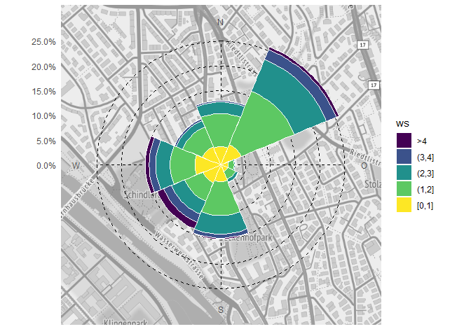

<!-- README.md is generated from README.Rmd. Please edit that file -->


rOstluft.plot
=============

Erstellen von Diagrammen für Ostluft Auswertungen und Berichte

Installation
============

Der Quellcode von [rOstluft.plot](https://github.com/Ostluft/rOstluft.plot) ist auf github gehosted. Die einfachste Variante ist die Installation mit Hilfe des Packages devtools:

``` r
#install.packages("devtools")
devtools::install_github("Ostluft/rOstluft.plot")
```

Beispiele
=========

Hysplit Trajektorien:
---------------------

``` r
library(rOstluft.plot)
fn <- system.file("extdata", "2017_ZH-Kaserne-hysplit.rds", package = "rOstluft.data")
traj <- readRDS(fn)
traj <- dplyr::filter(traj, date < lubridate::ymd("2017-01-08"))
hysplit_traj(traj, color_scale = ggplot2::scale_color_viridis_c(name = "m agl."))
```


Wind Density
------------

Inspiriert bei [visualising diurnal wind climatologies](https://www.r-bloggers.com/visualising-diurnal-wind-climatologies-2/)

WIP

``` r
library(rOstluft)
store <- storage_s3_rds("aqmet", format = format_rolf(), bucket = "rostluft", prefix = "aqmet")
data <- store$get(site = "ETHZ_CHN-Gebäude", year = 2017, interval = "h1")
plt_wind_density(data)
```



Wind Rose mit Background Karte
------------------------------

WIP

``` r
# get needed meta information, one row with x and y coordinates in lsv95
ethz <- store$get_meta("ethz")[[1]]
site <- ethz[1, ]
plt_wind_rose(data, site)
```


